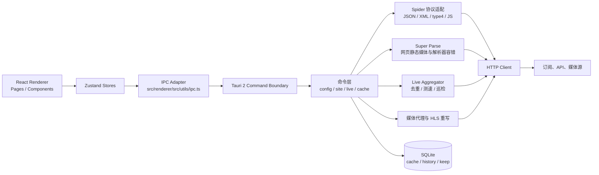
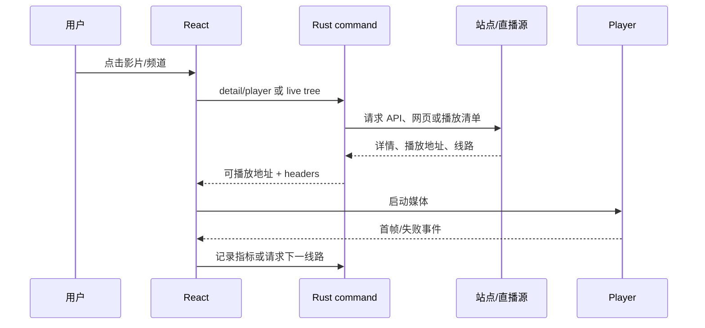

# 架构图

## 总体结构

## 播放链路

## 运行时边界

- Renderer 只负责交互、状态和播放器；不直接解析订阅协议。
- Rust command 负责参数校验、网络、协议适配、缓存和错误转换。
- SQLite 缓存是直播聚合库和播放指标的持久边界；配置订阅单独保存。
- 直播刷新是后台任务，发布缓存时不替换当前播放对象。
- 线路身份是 `url + normalized headers`；频道身份是归一化频道名。
